## Gereksinim Özeti

Kullanıcıların birbirine **fiyat etiketi olmadan** gerçek hediyeler (kahve, çikolata, kitap, çiçek vb.) gönderebildiği, marka sponsorluklarıyla finanse edilen, viral büyüme motoru üzerine kurulu bir mobil + web platformu.

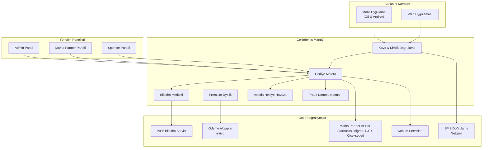

---

## Gereksinim Listesi

| # | Modül | Açıklama |
|---|-------|----------|
| 1 | Kayıt ve Onboarding | Telefon doğrulamalı sürtünmesiz kayıt, hediye-öncelikli onboarding |
| 2 | Ana Sayfa ve Hediye Keşfi | Günün hediyeleri, kategoriler, kişiselleştirilmiş öneriler |
| 3 | Hediye Gönderme | 3 adımda (seç → kişi seç → not ekle → gönder) 15 saniyelik akış |
| 4 | Hediye Alma ve Kullanım (Redeem) | Bildirim → Şube bulma → QR/Barkod ile fiziksel teslim alma |
| 5 | Bildirim Sistemi | Push, in-app ve SMS bildirimleri; durum güncellemeleri |
| 6 | Kullanıcı Profili ve Ayarlar | Profil yönetimi, tercihler, hediye geçmişi |
| 7 | Premium Üyelik | Aylık 29₺, genişletilmiş limitler ve özel hediyeler |
| 8 | Askıda Hediye (Sosyal Havuz) | Süresi dolan hediyelerin sosyal havuza aktarılması ve dağıtımı |
| 9 | Fraud Koruma Sistemi | Cihaz parmak izi, döngü algılama, sahte GPS tespiti, davranışsal analiz |
| 10 | Marka Partner Paneli | Ürün/stok yönetimi, kampanya oluşturma, performans raporları |
| 11 | Kurumsal Sponsor Paneli | Sponsorluk yönetimi, bütçe takibi, etki raporları |
| 12 | Admin Panel | Kullanıcı yönetimi, içerik moderasyonu, analitik dashboard |
| 13 | Limit ve Kural Motoru | Günlük gönderme/alma limitleri, hediye süresi, kara liste yönetimi |
| 14 | Konum Tabanlı Servisler | Yakın şube bulma, stok kontrolü, konum doğrulama |

---

## Detaylı Tasarım

### Modül 1: Kayıt ve Onboarding

**Mantık Akışı:**

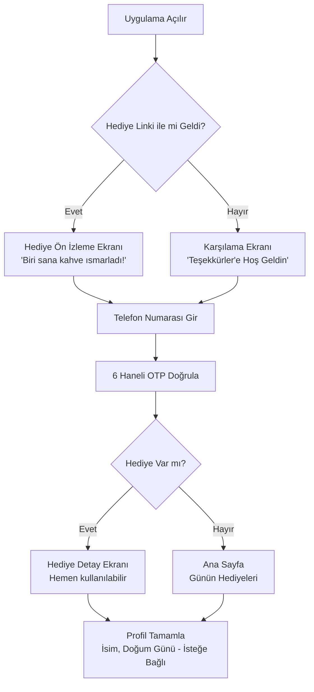

**Etkileşim Noktaları:**
- Karşılama ekranı: Tek sayfalık, minimal, "Biri seni düşünsün" mesajı
- Telefon girişi: Sadece numara, başka bilgi istenmez
- OTP ekranı: Otomatik doldurma desteği, 60 saniye geri sayım
- Profil tamamlama: Hediye alındıktan SONRA gösterilir, atlanabilir

**Wireframe — Onboarding Akışı:**
```
┌────────────────────┐   ┌────────────────────┐   ┌────────────────────┐
│                    │   │                    │   │                    │
│    ☕               │   │  Telefon Numaran   │   │    _ _ _ _ _ _     │
│                    │   │                    │   │                    │
│  Biri sana bir     │   │ ┌────────────────┐ │   │   Doğrulama kodu  │
│  kahve ısmarladı!  │   │ │ +90 5XX XXX XX │ │   │   gönderildi      │
│                    │   │ └────────────────┘ │   │                    │
│                    │   │                    │   │   00:58             │
│  [Hediyeni Al →]   │   │  [Devam Et →]      │   │                    │
│                    │   │                    │   │  [Tekrar Gönder]   │
└────────────────────┘   └────────────────────┘   └────────────────────┘
   Hediye Karşılama         Telefon Girişi            OTP Doğrulama
```

**Kabul Kriterleri:**
- [ ] Hediye linkiyle gelen kullanıcı, kayıt tamamlandıktan sonra doğrudan hediyesini görür
- [ ] Kayıt süreci 30 saniyenin altında tamamlanır
- [ ] OTP 10 saniye içinde kullanıcıya ulaşır
- [ ] Profil tamamlama zorunlu değildir, hediye almayı engellemez

---

### Modül 2: Ana Sayfa ve Hediye Keşfi

**Mantık Akışı:**

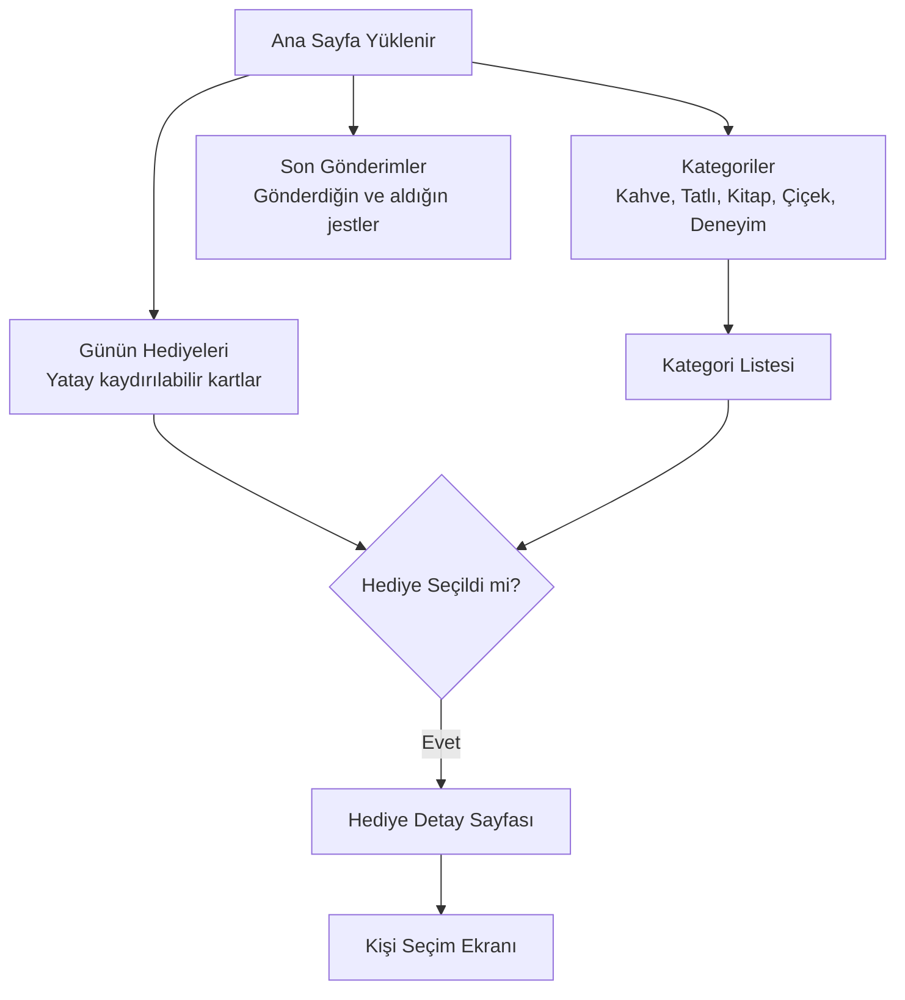

**Etkileşim Noktaları:**
- Günün hediyeleri: Fiyat bilgisi olmadan marka logosu + ürün görseli + ürün adı
- Kategoriler: Emoji + isim ile minimal kategori gösterimi
- "İyi Ki" puanı: Kullanıcının toplam jest sayısını gösteren barometer
- Sponsor rozeti: Hediye kartının altında zarif, küçük punto ile "Garanti BBVA sponsorluğundadır"

**Wireframe — Ana Sayfa:**
```
┌─────────────────────────────┐
│  Merhaba, Coşkun 👋         │
│  İyi Ki Puanın: ●●●●○ 4/5   │
├─────────────────────────────┤
│                             │
│  Bugün Neler Ismarlayabilirsin? │
│                             │
│  ┌─────┐ ┌─────┐ ┌─────┐   │
│  │ ☕  │ │ 🍫  │ │ 📖  │   │
│  │Latte│ │Tada.│ │K.Pr.│   │
│  │     │ │     │ │     │   │
│  └─────┘ └─────┘ └─────┘   │
│   ← kaydır →                │
│                             │
├─────────────────────────────┤
│  Son Jestlerin              │
│  ┌──────────────────────┐   │
│  │ → Ayşe'ye kahve ☕   │   │
│  │   "Bugün aklıma geldin" │
│  │ ← Mehmet'ten çikolata│   │
│  │   "Sebepsiz" 🍫       │   │
│  └──────────────────────┘   │
├─────────────────────────────┤
│  🏠   🎁   👤              │
│  Ana  Gönder Profil         │
└─────────────────────────────┘
```

**Kabul Kriterleri:**
- [ ] Hiçbir hediye kartında fiyat bilgisi yer almaz
- [ ] Stokta olmayan hediyeler otomatik olarak gizlenir
- [ ] Sponsor bilgisi görünür ama baskın değildir (max 10pt font)
- [ ] Hediye kartları tek elle kaydırılabilir

---

### Modül 3: Hediye Gönderme

**Mantık Akışı:**

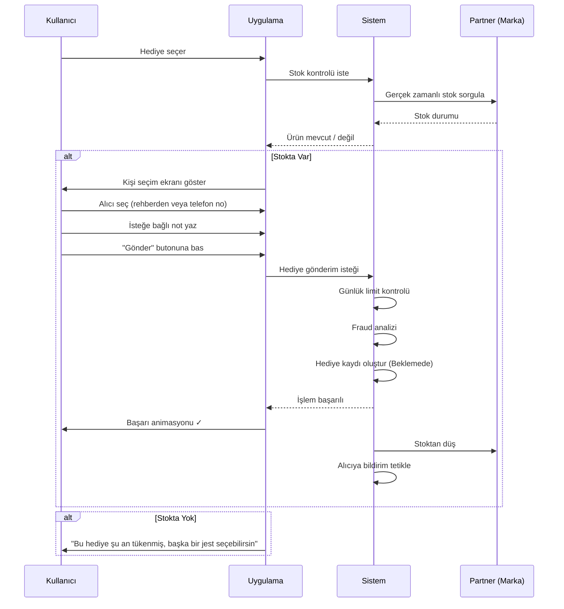

**Etkileşim Noktaları:**
- Adım 1 — Hediye Seç: Ana sayfadan tek dokunuş
- Adım 2 — Kişi Seç: Telefon rehberinden veya elle numara girerek
- Adım 3 — Not Ekle (opsiyonel): Metin notu, hazır mesajlar ("Bugün aklıma geldin", "Sebepsiz", "Geçen hafta için"), ileride sesli mesaj ve emoji animasyonu
- Gönder: Tek buton, onay ekranı yok (sürtünmeyi azaltma)
- Başarı ekranı: Kısa animasyon + "Jestini yaptın!" mesajı

**Kişi Seçim Ekranı Wireframe:**
```
┌─────────────────────────────┐
│  ← Kime Ismarlayacaksın?    │
├─────────────────────────────┤
│  🔍 İsim veya numara ara    │
├─────────────────────────────┤
│  Sık Gönderilenler          │
│  ┌────┐ ┌────┐ ┌────┐      │
│  │ AY │ │ MK │ │ SD │      │
│  │Ayşe│ │Meh.│ │Sel.│      │
│  └────┘ └────┘ └────┘      │
├─────────────────────────────┤
│  Rehberdekiler              │
│  ● Ahmet Yılmaz             │
│  ● Ayşe Kara                │
│  ● Burak Demir              │
│  ● ...                      │
├─────────────────────────────┤
│  📱 Numarayla Gönder        │
└─────────────────────────────┘
```

**Not Ekleme Wireframe:**
```
┌─────────────────────────────┐
│  ← Ayşe'ye Kahve ☕          │
├─────────────────────────────┤
│                             │
│  Bir not eklemek ister misin?│
│  (İsteğe bağlı)             │
│                             │
│  ┌─────────────────────────┐│
│  │                         ││
│  │ Bugün aklıma geldin...  ││
│  │                         ││
│  └─────────────────────────┘│
│                             │
│  Hızlı Seçenekler:          │
│  [Bugün aklıma geldin]      │
│  [Sebepsiz]                  │
│  [Geçen hafta için]          │
│  [Teşekkürler]               │
│                             │
│  ┌─────────────────────────┐│
│  │     ✨ GÖNDER ✨         ││
│  └─────────────────────────┘│
└─────────────────────────────┘
```

**Kabul Kriterleri:**
- [ ] Hediye gönderme süreci en fazla 15 saniye (3 adım)
- [ ] Günlük gönderim limiti aşıldığında dostça mesaj gösterilir
- [ ] Alıcı uygulamada değilse SMS ile bildirim gider
- [ ] Rehber erişimi reddedilse bile manuel numara girişiyle çalışır
- [ ] Kendine hediye göndermek mümkün değildir

---

### Modül 4: Hediye Alma ve Kullanım (Redeem)

**Mantık Akışı:**

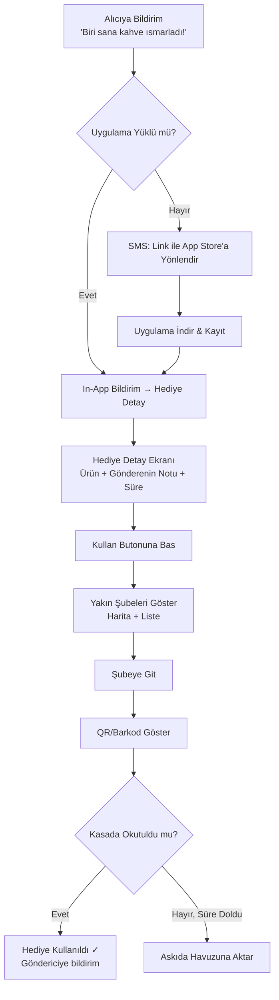

**Etkileşim Noktaları:**
- Hediye detay ekranı: Ürün görseli, gönderenin notu, kalan süre (72 saat geri sayım)
- Şube haritası: Kullanıcının konumuna göre en yakın 5 şube, stok durumu göstergesiyle
- QR/Barkod: Ekran parlaklığı otomatik artırılır, kasada kolay okutma için büyük gösterim
- Kullanım onayı: Kasada okutulduktan sonra kutlama animasyonu
- Süre uyarıları: 24 saat kala, 6 saat kala, 1 saat kala bildirim

**Redeem Ekranı Wireframe:**
```
┌─────────────────────────────┐
│  ← Hediye Detayı             │
├─────────────────────────────┤
│                             │
│        ☕                    │
│    Starbucks Latte          │
│                             │
│  Ayşe sana ısmarladı        │
│  "Bugün aklıma geldin"      │
│                             │
│  ⏰ 47 saat 23 dk kaldı     │
│  ████████████░░░ %66        │
│                             │
│  ┌─────────────────────────┐│
│  │   🎁 ŞİMDİ KULLAN      ││
│  └─────────────────────────┘│
│                             │
│  📍 En yakın şubeler:       │
│  • Starbucks Kadıköy (0.3km)│
│  • Starbucks Moda (1.1km)   │
│  • Starbucks Bağdat (2.4km) │
└─────────────────────────────┘
```

**Kabul Kriterleri:**
- [ ] QR/Barkod, internetiz ortamda da gösterilebilir (önceden indirilir)
- [ ] Hediye 72 saat sonra otomatik askıya düşer
- [ ] Kullanım sonrası göndericiye "Hediyeni aldı!" bildirimi gider
- [ ] Aynı hediye iki kez kullanılamaz
- [ ] Hediye başkasına devredilemez (kişisel)

---

### Modül 5: Bildirim Sistemi

**Bildirim Akışı:**

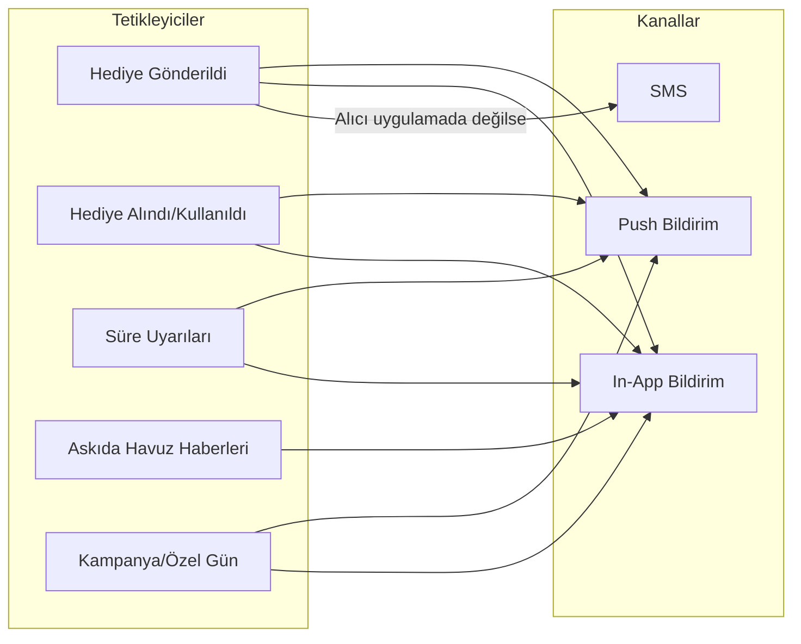

**Bildirim Mesaj Tasarımı:**

| Olay | Mesaj | Kanal |
|------|-------|-------|
| Hediye geldi | "Biri sana bir kahve ısmarladı ☕" | Push + SMS (yoksa) |
| Hediye kullanıldı | "Ayşe hediyeni aldı! ✓" | Push |
| 24 saat kaldı | "Kahven seni bekliyor, 24 saat kaldı ⏰" | Push |
| 1 saat kaldı | "Son 1 saat! Kahveni almayı unutma" | Push |
| Askıya düştü | "Hediyeni alamadın ama bir öğrenciyi mutlu etti 💛" | Push |
| Günlük limit doldu (alıcı) | "Bu kişi bugün çok sevildi, yarın tekrar deneyebilirsin" | In-app |

**Kabul Kriterleri:**
- [ ] Bildirimler kişiselleştirilmiş (gönderen adı ve ürün adı içerir)
- [ ] Bildirim tercihleri ayarlardan yönetilebilir
- [ ] SMS bildirimleri sadece kritik durumlar için (hediye geldi, uygulaması yoksa)
- [ ] Spam algısı yaratmayacak sıklıkta (günde max 3 push)

---

### Modül 6: Kullanıcı Profili ve Ayarlar

**Etkileşim Noktaları:**
- Profil sayfası: İsim, telefon, profil fotoğrafı, doğum günü
- Hediye geçmişi: Gönderilen ve alınan jestlerin zaman çizelgesi
- İyi Ki puanı: Toplam jest sayısına dayalı seviye sistemi
- Bildirim tercihleri: Push, SMS açma/kapama
- Premium üyelik yönetimi
- Hesap silme / çıkış

**Wireframe — Profil:**
```
┌─────────────────────────────┐
│  ┌───┐                      │
│  │ CK│  Coşkun              │
│  └───┘  İyi Ki Puanı: 12 ✨  │
├─────────────────────────────┤
│                             │
│  📤 Gönderdiğin Jestler: 8  │
│  📥 Aldığın Jestler: 4      │
│  🌟 Askıya Düşen: 2         │
│     (2 öğrenci mutlu oldu)  │
│                             │
├─────────────────────────────┤
│  ⚙️ Ayarlar                 │
│  👤 Profili Düzenle          │
│  🔔 Bildirim Tercihleri      │
│  ⭐ Premium Üyelik           │
│  📋 Gizlilik Politikası      │
│  🚪 Çıkış Yap               │
└─────────────────────────────┘
```

**Kabul Kriterleri:**
- [ ] Hediye geçmişinde fiyat bilgisi kesinlikle yer almaz
- [ ] Profil fotoğrafı opsiyoneldir
- [ ] Hesap silme KVKK uyumlu, 30 gün içinde kalıcı silinme

---

### Modül 7: Premium Üyelik

**İş Kuralları:**

| Özellik | Ücretsiz | Premium (29₺/ay) |
|---------|----------|-------------------|
| Günlük gönderim | 1 hediye | 3 hediye |
| Hediye kataloğu | Standart | Standart + Özel (restoran, deneyim) |
| Planlı gönderim | ✗ | ✓ (doğum günü hatırlatma) |
| Sesli not | ✗ | ✓ |
| Özel animasyonlar | ✗ | ✓ |

**Dönüşüm Akışı:**

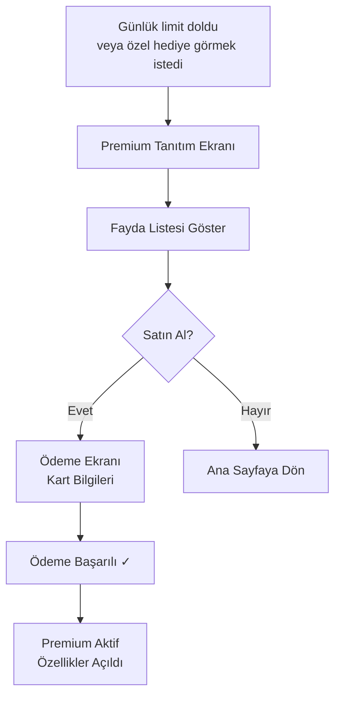

**Kabul Kriterleri:**
- [ ] Üyelik iyzico üzerinden güvenli ödeme ile yapılır
- [ ] İptal her an yapılabilir, dönem sonuna kadar aktif kalır
- [ ] Premium deneme süresi: İlk 7 gün ücretsiz (opsiyonel kampanya)
- [ ] Planlı gönderimler: Doğum günü ve özel günler için tarih seçip hediye programlama

---

### Modül 8: Askıda Hediye (Sosyal Havuz)

**Mantık Akışı:**

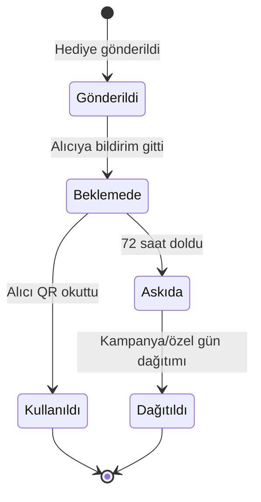

**Etkileşim Noktaları:**
- Hediye süresi dolduğunda sistem otomatik olarak "Askıda" statüsüne geçirir
- Göndericiye bilgilendirme: "Arkadaşın hediyesini zamanında alamamıştı ama bugün bir öğrenciyi mutlu etti!"
- Askıda havuzundaki hediyeler özel günlerde (Öğretmenler Günü, Ramazan vb.) dezavantajlı gruplara dağıtılır
- Ana sayfada "Askıda Barometer": Toplam topluluk olarak kaç jest askıya düştü ve kaç kişi mutlu edildi

**Kabul Kriterleri:**
- [ ] Süresi dolan hiçbir hediye "yanmaz", mutlaka askıya düşer
- [ ] Göndericiye askıya düşme ve dağıtılma aşamalarında bildirim gider
- [ ] Dağıtım algoritması rastgele ve adildir
- [ ] Markalar, askıda havuz verilerini anonim raporlarla görebilir

---

### Modül 9: Fraud Koruma Sistemi

**Koruma Katmanları:**

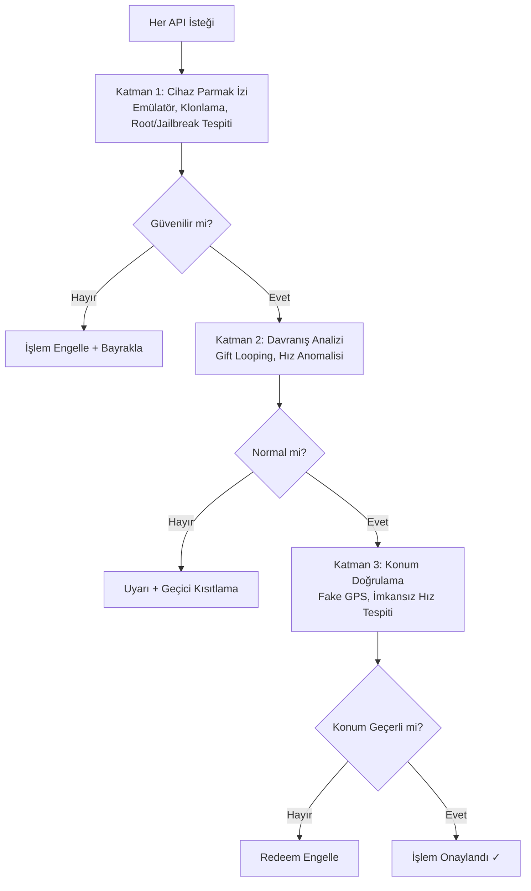

**Korunan Senaryolar:**

| Saldırı Tipi | Tespit Yöntemi | Müdahale |
|-------------|----------------|----------|
| Sahte hesap açma | Cihaz parmak izi tekrarı tespiti | Kayıt engelle |
| Gift Looping (A↔B) | İki yönlü hediye örüntü analizi | "Başka birini mutlu etmeye ne dersin?" |
| Toplu hediye çekme | Günlük alma limitini aşma girişimi | 4. hediyeyi engelle |
| Sahte GPS ile redeem | Wi-Fi/Bluetooth konum doğrulama | Kullanım engelle |
| Bot/Emülatör | Donanım sensör analizi, tutuş davranışı | Oturum engelle |
| Uygulama klonlama | Paket adı ve bütünlük kontrolü | Klonu engelle |

**Kabul Kriterleri:**
- [ ] Fraud kontrolleri kullanıcı deneyimini yavaşlatmaz (100ms altı)
- [ ] Yanlış pozitif oranı %0.1'in altında
- [ ] Kara listeye alınan cihazlar fabrika ayarına dönse bile tanınır
- [ ] Gift looping 3. tekrarda algılanır ve dostça mesajla yönlendirilir

---

### Modül 10: Marka Partner Paneli (Web)

**Fonksiyonlar:**

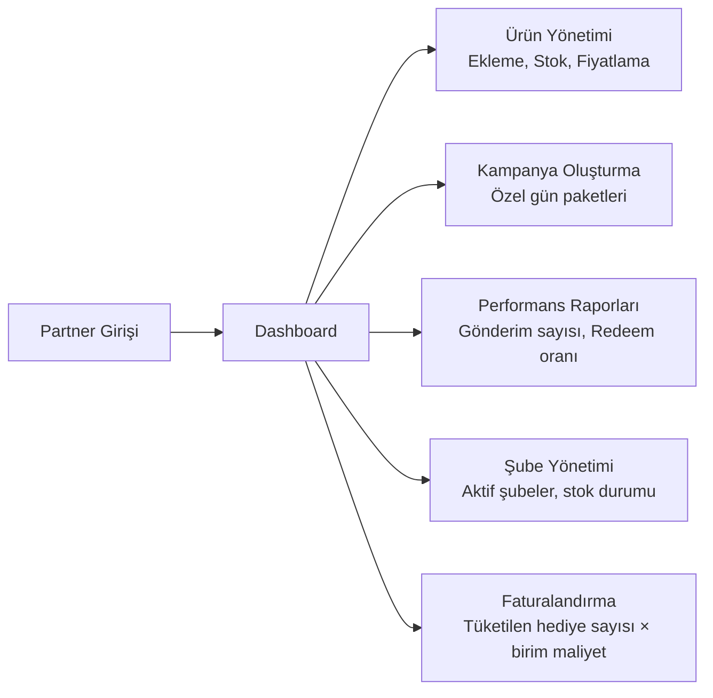

**Kabul Kriterleri:**
- [ ] Partnerler ürün ekleme/çıkarma/stok güncelleme yapabilir
- [ ] Gerçek zamanlı redeem verileri dashboard'da görünür
- [ ] Aylık faturalandırma raporu otomatik oluşturulur
- [ ] API entegrasyonu ile otomatik stok senkronizasyonu desteklenir

---

### Modül 11: Kurumsal Sponsor Paneli (Web)

**İş Akışı:**

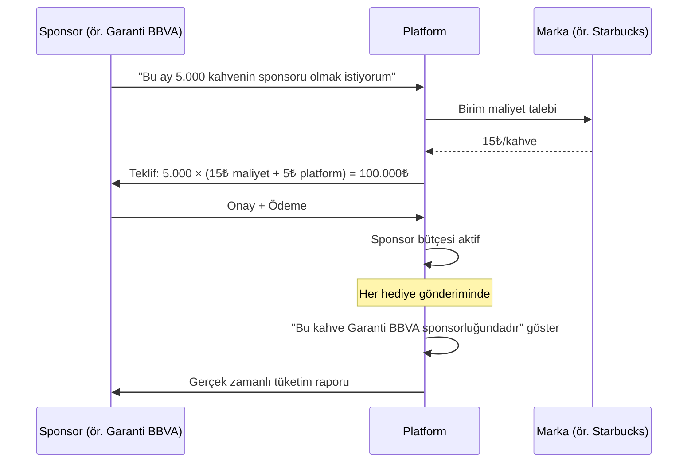

**Kabul Kriterleri:**
- [ ] Sponsor, bütçe kullanım oranını gerçek zamanlı görebilir
- [ ] Sponsor rozeti zarif ve duygusal anı bozmayacak şekilde tasarlanır
- [ ] Kampanya dönemi belirlenebilir (başlangıç-bitiş tarihi)
- [ ] Etki raporu: Kaç kişi mutlu edildi, hangi şehirlerde, askıda oranı

---

### Modül 12: Admin Panel (Web)

**Fonksiyonlar:**
- Kullanıcı yönetimi: Arama, detay görüntüleme, kara listeye alma
- İçerik moderasyonu: Hediye notları inceleme (uygunsuz içerik tespiti)
- Fraud merkezi: Bayraklanan işlemlerin incelenmesi ve aksiyonu
- Analitik dashboard: Günlük/haftalık/aylık KPI'lar
- Partner/Sponsor yönetimi: Onaylama, düzenleme
- Sistem sağlığı: Servis durumları, hata oranları

**Kabul Kriterleri:**
- [ ] Rol bazlı erişim (süper admin, operasyon, destek)
- [ ] Tüm admin aksiyonları audit log'a kaydedilir
- [ ] Dashboard yükleme süresi 3 saniyenin altında

---

### Modül 13: Limit ve Kural Motoru

**Kural Tablosu:**

| Kural | Ücretsiz Kullanıcı | Premium Kullanıcı | Açıklama |
|-------|-------------------|-------------------|----------|
| Günlük gönderim | 1 | 3 | Gece 00:00'da sıfırlanır |
| Günlük alma | 3 | 3 | Tüm kullanıcılar için aynı |
| Hediye kullanım süresi | 72 saat | 72 saat | Süresi dolunca askıya düşer |
| Kendine gönderim | ✗ | ✗ | Sistem seviyesinde engel |
| Hediye devretme | ✗ | ✗ | Hediye kişiseldir |
| Aynı kişiye art arda | 24 saat bekleme | 24 saat bekleme | Döngüyü önleme |

**Limit Aşımı Mesajları:**
- Gönderme limiti: "Bugünkü jestini yaptın! Yarın yeni bir jest bekliyor ✨"
- Alma limiti (alıcı dolu): "Bu kişi bugün çok sevildi, yarın tekrar deneyebilirsin 💛"
- Döngü tespiti: "Başka birini de mutlu etmeye ne dersin?"

---

### Modül 14: Konum Tabanlı Servisler

**Akış:**

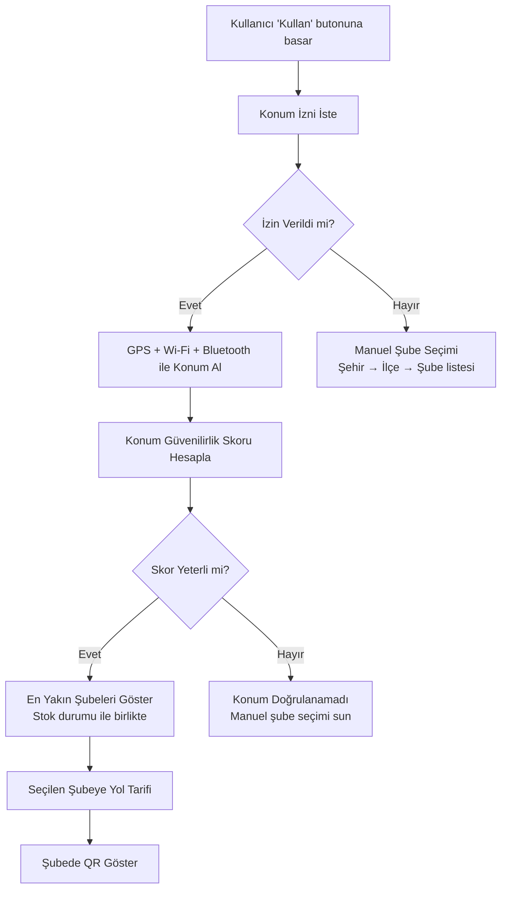

**Kabul Kriterleri:**
- [ ] Konum izni reddedilse bile uygulama çalışır (manuel seçim)
- [ ] Şube listesinde anlık stok durumu gösterilir (Var / Az / Yok)
- [ ] Harita entegrasyonu ile yol tarifi verilebilir

---

## Kenar Durumlar

| Senaryo | Tetik Koşulu | Müdahale | Geri Dönüş |
|---------|-------------|----------|------------|
| Geçersiz API anahtarı (marka) | Partner API kimlik doğrulama hatası | Admin'e alarm, kullanıcıya "Şu an bu hediye kullanılamıyor" | İlgili markanın hediyeleri geçici gizlenir |
| İnternet bağlantısı yok | Çevrimdışı durumda hediye gönderme girişimi | "Bağlantın kesildi, birazdan tekrar dene" | Taslak olarak sakla, bağlantıda otomatik gönder |
| Hediye kullanımı sırasında POS hatası | QR okutma başarısız | "Bir sorun oluştu, kasiyerden yardım iste" + Yedek alfanumerik kod göster | Kasiyerin manuel girebileceği 6 haneli kod |
| Stok tükenmesi (hediye gönderildikten sonra) | Marka stoğu, gönderim-kullanım arasında bitti | "Bu ürün geçici olarak tükendi, en yakın X şubesinde mevcut" | Alternatif şube öner veya hediyeyi askıya al |
| Rate limiting (iyzico) | Ödeme sistemi yoğunluk | "Ödeme işlemi şu an meşgul, 30 sn sonra tekrar dene" | Otomatik yeniden deneme (3 kez, 30sn aralıkla) |
| Kullanıcı hesap silme talebi | KVKK/GDPR kapsamında | Tüm kişisel veri 30 gün içinde silinir, aktif hediyeler iptal | Anonim istatistik verileri saklanır |
| Çift cihazda aynı hesap | Aynı telefon numarası iki cihazda | Yeni cihazda oturum açma, eski cihazda otomatik çıkış | Tek aktif oturum politikası |
| Hediye gönderirken alıcı kara listede | Fraud nedeniyle engellenmiş alıcı | "Bu kişiye şu an hediye gönderilemez" | Ayrıntı vermeden engelle |
| Marka partnerliği sona erdi | Anlaşma bitişi | Mevcut hediyeler kullanılabilir, yeni gönderim durdurulur | İlgili marka hediyeleri katalogdan kaldırılır |
| Yüksek trafik (özel gün) | Anneler Günü, yılbaşı trafiği | Otomatik ölçeklendirme, kuyruk sistemi | Gecikme bildirimi: "Yoğunluk var, jestin yolda!" |

---

## Veri Spesifikasyonu

### Temel Takip Noktaları (Analytics Events)

| Olay Adı | Tetik Koşulu | Anahtar Özellikler |
|----------|-------------|-------------------|
| `app_opened` | Uygulama açılışı | kaynak (link/organik), platform (iOS/Android/Web) |
| `registration_completed` | OTP doğrulandı | süre (sn), kaynak (hediye_linki/organik) |
| `gift_selected` | Hediye kartına tıklama | hediye_id, kategori, marka |
| `gift_sent` | Gönder butonuna basma | hediye_id, alıcı_tipi (rehber/manuel), not_var_mı |
| `gift_redeemed` | QR kasada okutuldu | hediye_id, şube_id, süre (gönderimden kullanıma) |
| `gift_expired` | 72 saat doldu | hediye_id, alıcı_bildirim_sayısı |
| `gift_to_pool` | Askıya düştü | hediye_id, havuz_büyüklüğü |
| `premium_started` | Ödeme başarılı | kaynak_ekran, deneme_mi |
| `premium_cancelled` | İptal | kullanım_süresi, toplam_gönderim |
| `fraud_flagged` | Fraud sistemi bayrak kaldırdı | tip (looping/fake_gps/emulator), skor |
| `notification_opened` | Bildirim tıklandı | bildirim_tipi, gecikme (gönderimden tıklamaya) |

### Minimum KPI Seti

| KPI | Tanım | Hedef |
|-----|-------|-------|
| DAU / MAU | Günlük/Aylık aktif kullanıcı | İlk 3 ayda 10K MAU |
| Viral Katsayı (K) | Gönderilen hediye × yeni kullanıcıya dönüşme oranı | K > 1.0 |
| Redeem Oranı | Gönderilen hediyelerin kullanılma yüzdesi | > %60 |
| Askıda Oranı | Süresi dolup askıya düşen hediye oranı | < %40 |
| Ortalama Gönderim Süresi | Hediye seçiminden gönderime geçen süre | < 15 sn |
| Kayıt Dönüşümü | Uygulamayı açanların kayıt tamamlama oranı | > %70 |
| Premium Dönüşümü | Ücretsiz kullanıcıların premium'a geçiş oranı | > %5 |
| Fraud Oranı | Bayraklanan işlemlerin toplam işleme oranı | < %0.5 |
| NPS | Kullanıcı memnuniyeti skoru | > 50 |
| Sponsor ROI | Sponsor başına hediye tüketimi ve marka hatırlanırlığı | Raporlanır |

---

## Doğrulama ve Tamamlanma Kriterleri

| Adım | Hedef Çıktılar | Doğrulama |
|------|----------------|-----------|
| Kayıt & Onboarding | Telefon doğrulama, hediye-öncelikli akış | Hediye linkiyle gelen kullanıcı 30sn'de hediyesine ulaşır |
| Ana Sayfa | Hediye keşfi, fiyatsız kartlar | Hiçbir ekranda fiyat bilgisi görünmez |
| Hediye Gönderme | 3 adım, 15sn akış | Uçtan uca gönderim 15sn'de tamamlanır |
| Hediye Alma (Redeem) | QR/Barkod, şube haritası | Gerçek bir şubede QR ile ürün alınabilir |
| Bildirimler | Push, SMS, in-app | Hediye gönderildiğinde alıcı 10sn içinde bildirim alır |
| Premium | Ödeme, genişletilmiş özellikler | iyzico ile başarılı ödeme ve özellik açılması |
| Askıda Hediye | Otomatik havuz, dağıtım | 72 saat sonra hediye askıya düşer, göndericiye bildirim gider |
| Fraud Koruma | Çok katmanlı güvenlik | Emülatör, fake GPS ve looping tespit edilir |
| Partner Panel | Stok, kampanya, raporlama | Partner gerçek zamanlı redeem verisi görür |
| Sponsor Panel | Bütçe, rozet, etki raporu | Sponsor kullanım oranını takip edebilir |
| Admin Panel | Kullanıcı yönetimi, analitik | KPI dashboard 3sn'de yüklenir |
| Konum Servisleri | Şube bulma, stok durumu | En yakın 5 şube stok durumuyla listelenir |
| Limitler | Günlük gönderim/alma kuralları | Limitler aşıldığında dostça mesaj gösterilir |
